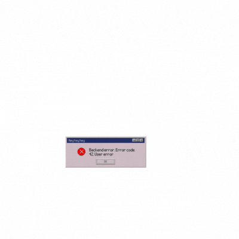

<h1 align="center">Hi I'm Chandan HM 👋</h1>
<h3 align="center">A passionate Front-End developer from Karnataka</h3>

- 🔭 I’m currently working on [Own Projects](https://github.com/chandanhm1999)

- 🌱 I’m currently learning **Node Js and FastAPI**

- 👨‍💻 All of my projects are available at [https://my-protfolio-web-chandan-hm.vercel.app/](https://my-protfolio-web-chandan-hm.vercel.app/)

- 💬 Ask me about **React Js, Next Js, MongoDB, SQL & JavaScript ect...**

- 📫 How to reach me **chandanchanduhm4@gmail.com** 📱 Phone: **+91-8105114625**

<h3 align="left">Connect with me:</h3>

<h3 align="left">Languages and Tools:</h3>

                   

